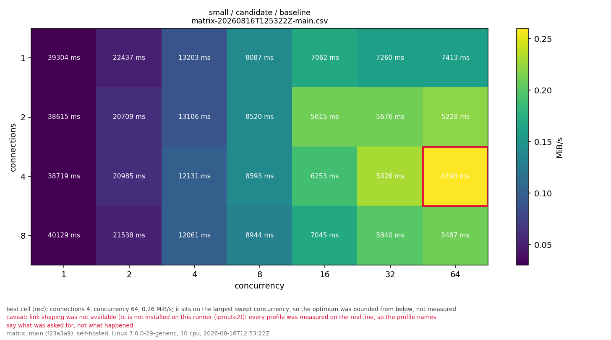
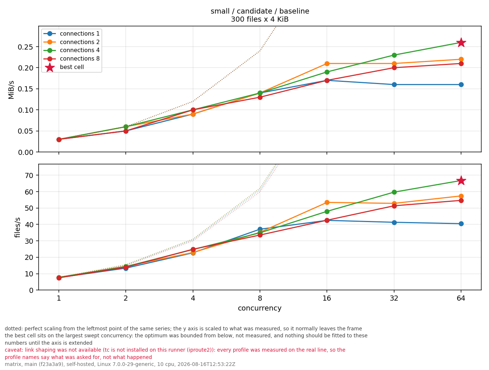
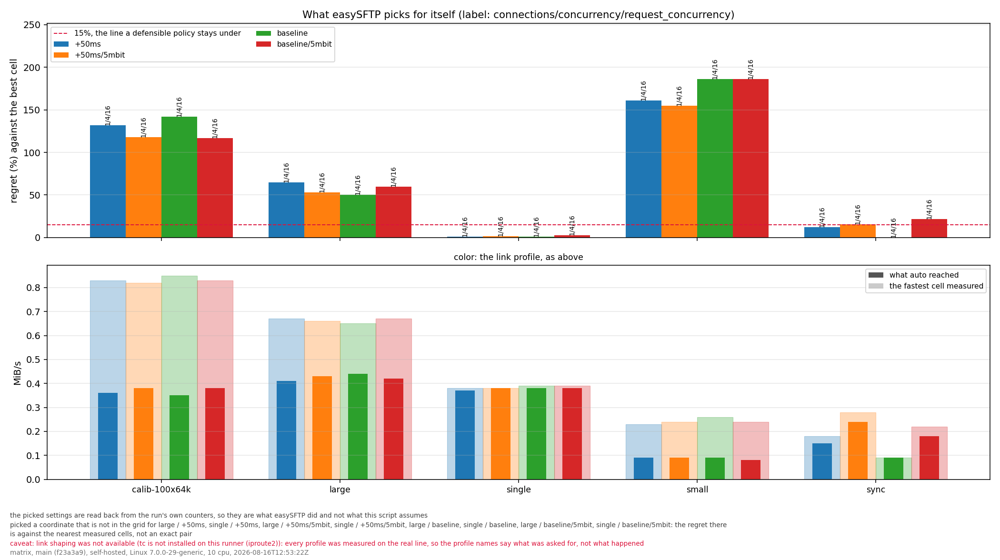
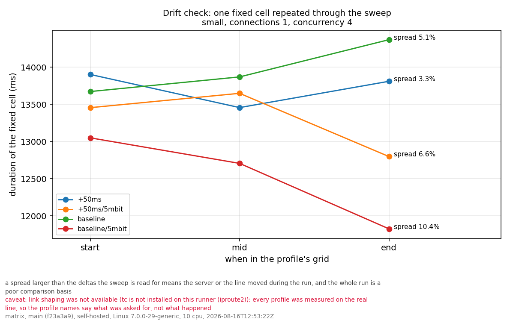
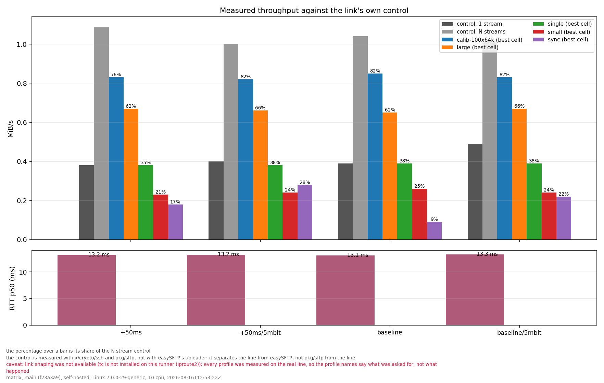
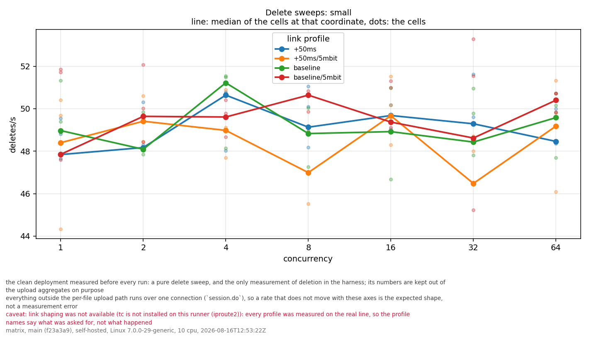
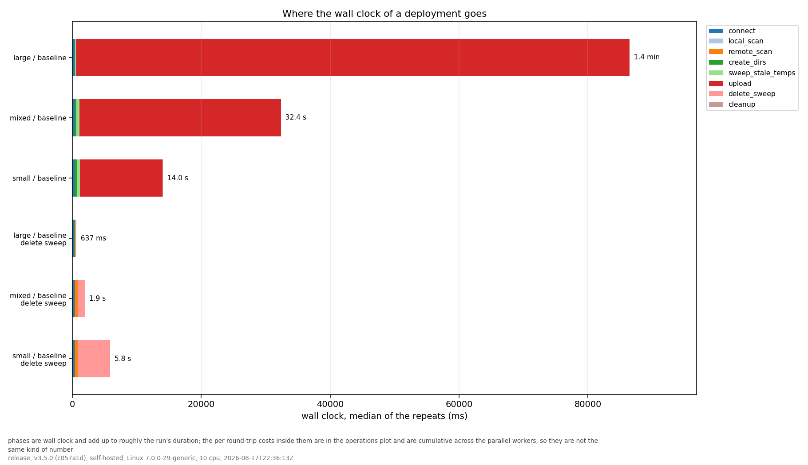
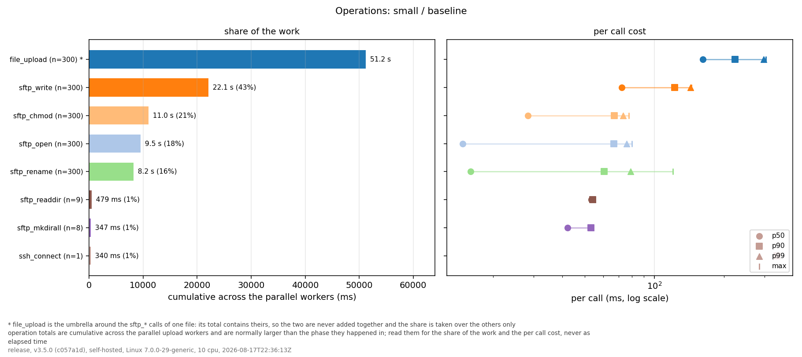
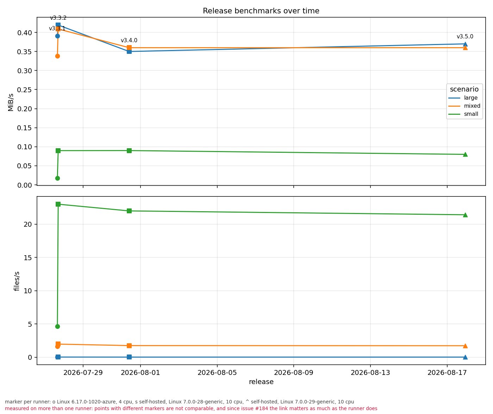

# Benchmark analysis (optional)

Downstream reading of benchmark results: the sweep as a grid and as curves,
where a deployment's wall clock goes, what the round-trips cost, what easySFTP
picks for itself against what a sweep would have picked, and throughput across
releases. This directory is **not** part of running, storing or validating a
benchmark. `cmd/easysftp-bench` does all of that and needs nothing from here
(issue #190).

The relationship is one way. Everything in here consumes the canonical outputs
the Go harness writes, and nothing in here may become an input to them:

```
cmd/easysftp-bench  ->  results.json / matrix.json / *.csv / index.json / trend.csv
                             |
                             v
                    benchmarks/analysis/  ->  plots, models, notebooks
```

A chart is a reading of the data, never a replacement for it. If a plot and the
JSON disagree, the JSON is right. Do not commit generated plots by default;
`out/` is ignored. Attach them to the run or the issue that needed them, and
commit one only when a document refers to it. The gallery below is that
exception, and the commands under it regenerate exactly those files.

```
benchdata.py    reads the stored documents; knows the schema, not matplotlib
plot.py         draws; one function per command
test_plot.py    self-checks, run offline against what is stored here
out/            output, ignored except for the gallery below
```

## Use

```bash
python -m venv .venv && . .venv/bin/activate   # Windows: .venv\Scripts\activate
```

```bash
pip install -r benchmarks/analysis/requirements.txt
```

Every command takes zero or more stored files and falls back to the newest one
of the kind it needs (`benchmarks/latest.json` for a run, the newest
`benchmarks/matrix/matrix-*` for a sweep). All of them write into
`benchmarks/analysis/out/` unless `--out` says otherwise and print the path of
every file they wrote.

| Command | What it draws | Reads |
|---|---|---|
| `heatmap` | throughput over the connections x concurrency grid | `matrix.csv` |
| `scaling` | the same cells as curves, against the linear reference | `matrix.json` |
| `auto` | what easySFTP picks for itself against the best cell | `matrix.json` |
| `canary` | whether the line held still for the whole sweep | `matrix.json` |
| `phases` | where the wall clock of a deployment goes | either |
| `operations` | per round-trip cost and share of the work | either |
| `deletes` | the delete sweeps, the only measurement of deletion | either |
| `link` | measured throughput against the link's own control | either |
| `trend` | throughput per scenario across releases | `trend.csv` |
| `report` | everything the given files support, plus `report.md` | both |

"either" means a stored run (`release-*.json`, `manual-*.json`, `latest.json`)
or a sweep. For a run it draws the measured result; for a sweep it draws the
**best cell** of each scenario and profile, taken from `scaling[].best`, since
a sweep has hundreds of cells and only the one that won is worth taking apart.

Everything at once, for the newest release result and the newest sweep:

```bash
python benchmarks/analysis/plot.py report
```

Common options, valid on every command:

| Option | Effect |
|---|---|
| `--scenario small,large` | only these scenarios |
| `--profile baseline` | only these link profiles |
| `--out DIR` | write somewhere else |
| `--format png\|svg\|pdf`, `--dpi N` | how to write it |
| `--metric mib_per_s\|files_per_s\|median_ms` | what `heatmap` colors and ranks by |
| `--include-deletes` | `phases`: add the delete sweeps as their own bars |

## Reading the plots

Every figure carries its provenance under it, and any caveat the stored file
justifies in red: a run measured with `tc` unavailable has link profile names
that say what was *asked for*, not what happened, and a chart cannot tell that
by itself.

A **heatmap** cell is one measured configuration: `connections` down,
`concurrency` across, colored by throughput (brighter is faster) and labelled
with the median duration. The fastest cell is boxed in red. Two things to look
for, and they are the reason the grid exists at all:

- Where the bright region stops. Scaling that flattens along `concurrency` but
  keeps improving along `connections` means the run is bounded per connection,
  not by worker count.
- Whether the best cell touches the edge of the grid. If it does, the optimum
  was not measured, only bounded from below, and nothing should be fitted to
  the numbers until the axis is extended. `matrix.json` says the same thing in
  `scaling[].best_at_axis_max`, and that field is the authority.

**scaling** is the same cells read as curves, against the axis that actually
varied for that scenario (`scenario.AxisFor` caps both axes at the file count,
so `single` sweeps only `request_concurrency` and `small` only the other two).
The dotted line is perfect scaling from the leftmost point of the same series;
the gap to it is what the setting is worth. The y axis is scaled to what was
measured, so the reference normally leaves the frame.

**auto** scores easySFTP's own choice against the fastest cell of the same
scenario and profile. The picked coordinate is read back from the run's own
counters, so it is what easySFTP did, not what the plot assumes. A policy
within roughly 15% on every profile is defensible, one that only wins on the
house line is not (issue #184, phase 5; the policy itself is issue #156).

**canary** is one fixed cell repeated at the start, the middle and the end of
each profile's grid. A spread larger than the deltas the sweep is read for
means the server or the line moved during the run, and the whole run is a poor
comparison basis.

**phases** and **operations** are two different kinds of number and the plots
say so. A phase is wall clock and the bars add up to roughly the run's
duration. An operation total is cumulative across the parallel upload workers,
so it is normally *larger* than the phase it happened in: read it for its share
of the work and its per call cost, never as elapsed time. `file_upload` is the
umbrella around the `sftp_*` calls of one file, so its total contains theirs
and the share is taken over the others only.

**deletes** is the clean deployment measured before every run (issue #184,
phase 4). It is a pure delete sweep and the only measurement of deletion in the
harness. Everything outside the per-file upload path runs over one connection
(`session.do`), so a rate that does not move with `connections` or
`concurrency` is the expected shape, not a measurement error.

**link** puts the measured throughput next to the control `cmd/linkprobe` took
over the same path with x/crypto/ssh and pkg/sftp. That control imports nothing
from `internal/uploader`, which is what makes it one: read against it, a slower
easySFTP and a slower line stop looking the same.

A **trend** point is one stored release measurement of one scenario, with a
marker per runner. Compare points only within the same `environment` and, since
issue #184, the same `link`: a faster line and a faster easySFTP look identical
here otherwise. The trend chart cannot tell them apart and does not try.

## The committed gallery

`out/` is ignored, but these files are committed because this page refers to
them. They are the newest stored sweep
(`matrix/matrix-20260816T125322Z-main`) and the newest release result
(`latest.json`, v3.5.0), and they are regenerated by exactly the commands
under each image.

| The grid | Where scaling stops paying |
|---|---|
|  |  |

```bash
python benchmarks/analysis/plot.py heatmap benchmarks/matrix/matrix-20260816T125322Z-main.csv --scenario small --profile baseline
```

```bash
python benchmarks/analysis/plot.py scaling benchmarks/matrix/matrix-20260816T125322Z-main.json --scenario small --profile baseline
```

| The policy against the grid | Did the line hold still |
|---|---|
|  |  |

```bash
python benchmarks/analysis/plot.py auto benchmarks/matrix/matrix-20260816T125322Z-main.json
```

```bash
python benchmarks/analysis/plot.py canary benchmarks/matrix/matrix-20260816T125322Z-main.json
```

| Against the line itself | Deletion |
|---|---|
|  |  |

```bash
python benchmarks/analysis/plot.py link benchmarks/matrix/matrix-20260816T125322Z-main.json
```

```bash
python benchmarks/analysis/plot.py deletes benchmarks/matrix/matrix-20260816T125322Z-main.json --scenario small
```

| Where the wall clock goes | What the round-trips cost |
|---|---|
|  |  |

```bash
python benchmarks/analysis/plot.py phases --include-deletes
```

```bash
python benchmarks/analysis/plot.py operations --scenario small
```

Across releases:



```bash
python benchmarks/analysis/plot.py trend
```

## Self-checks

```bash
python -m unittest discover -s benchmarks/analysis
```

They need matplotlib and the stored results, nothing else: no benchmark is run
and no server is contacted. Two things are asserted, and they are the two ways
this layer breaks. Every result committed under `benchmarks/` is loaded, so a
reader that only understands the newest schema version fails instead of
silently dropping the older files; and every command is drawn into a temporary
directory, so a plot that raises on a field that moved fails here rather than
on the day someone needs the picture.

CI runs them too, in the `analysis-tests` job of `.github/workflows/ci.yml`,
on every pull request that touches `benchmarks/` and on every push to main.
Pull requests that touch nothing here skip the job's steps, because these
checks have nothing to say about a change to the uploader.

## Adding to this

Keep it reproducible and keep it optional: read only the canonical files, pin
what you import in `requirements.txt`, and do not reach into `internal/` or
shell out to the harness. Schema knowledge belongs in `benchdata.py`, drawing
in `plot.py`, and a new command needs a row in the table above, a paragraph
under "Reading the plots" and a case in `test_plot.py`. If an analysis turns
out to be something the project needs on every run, that is an argument for
putting it in the Go harness, not for making this directory a dependency of it.
